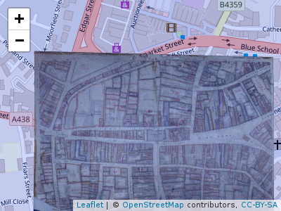

serving historic maps
=====================

``` r
library(leaflet)
library(osmdata)
#> Data (c) OpenStreetMap contributors, ODbL 1.0. http://www.openstreetmap.org/copyright
h = getbb("hereford, uk", format_out = "sf_polygon")
leaflet(data = h) %>% 
  addTiles(group = "2") %>% 
  # addProviderTiles(leaflet::providers$OpenStreetMap.BlackAndWhite, group = "1") %>% 
  addTiles(urlTemplate = "https://katyrobin.github.io/tithe-map-tiles/hereford-many/{z}/{x}/{y}.png", options = list(tms = "true")) %>% 
  addPolygons() %>% 
  setView(
    lng = sf::st_coordinates(sf::st_centroid(h))[1] + 0.004,
    lat = sf::st_coordinates(sf::st_centroid(h))[2],
    zoom = 16)
#> Warning in st_centroid.sfc(st_geometry(x), of_largest_polygon =
#> of_largest_polygon): st_centroid does not give correct centroids for
#> longitude/latitude data

#> Warning in st_centroid.sfc(st_geometry(x), of_largest_polygon =
#> of_largest_polygon): st_centroid does not give correct centroids for
#> longitude/latitude data
```


